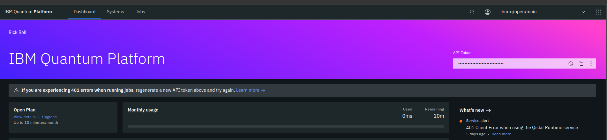

# IBM Quantum Challenge 2024

This repository contains the solutions to the exercises of the IBM Quantum Challenge 2024. The challenge was held from 05th June 2024 to 15th June 2024. The challenge was divided into five parts: Part 0, Part 1, Part 2, Part 3, and Part 4. The solutions to the exercises of all parts are provided in this repository.

## Challenge Content

- [Lab 0](./lab-0.ipynb): Welcome and Hello World
- [Lab 1](./lab-1.ipynb): Introduction Qiskit 1.0
- [Lab 2](./lab-2.ipynb): The Transpiler
- [Lab 3 - Part 1](./lab-3-ai-transpiler.ipynb): AI Transpiler
- [Lab 3 - Part 2](./lab-3-code-assistant.ipynb): Code Assistant

## How to run the notebooks

1. Create a `.env` file in the root directory of the repository.
1. Add the following content to the `.env` file:

    ```bash
    api_token=<IBM Quantum API Token>
    ```


    To get the IBM Quantum API Token, follow the steps mentioned [here](https://quantum.ibm.com/).


    

1. Create a conda environment:

    ```bash
    conda create --name ibm-quantum-challenge python=3.10
    conda activate ibm-quantum-challenge
    ``` 
    
1. Install the required dependencies:

    ```bash
    pip install -r requirements.txt
    ```

---

_The full walkthrough along with explanations and solutions to the exercises will be provided after the challenge ends._
